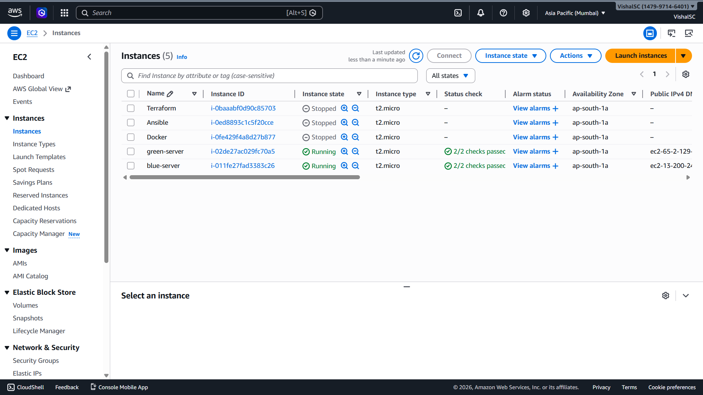
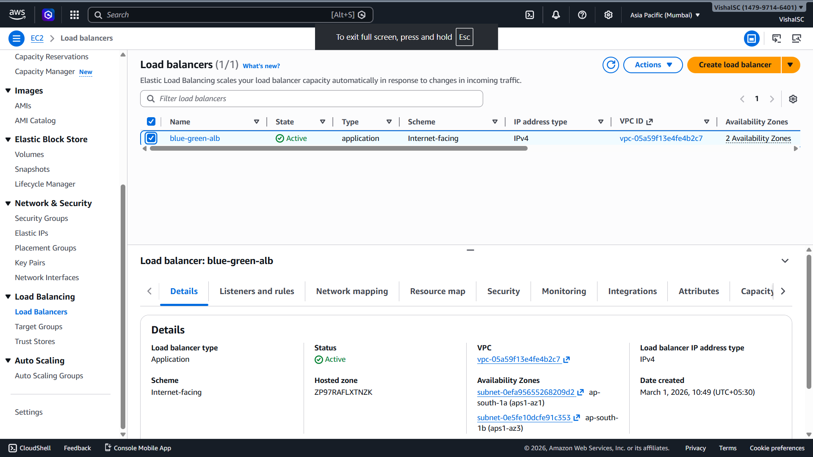
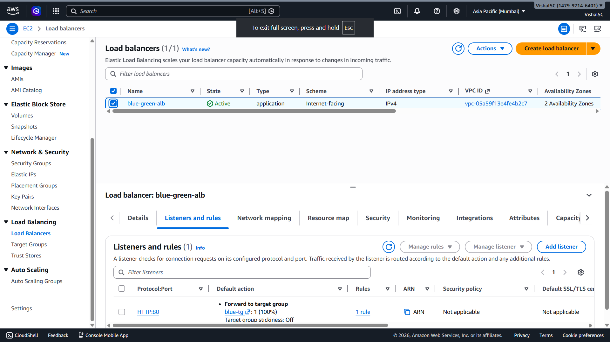
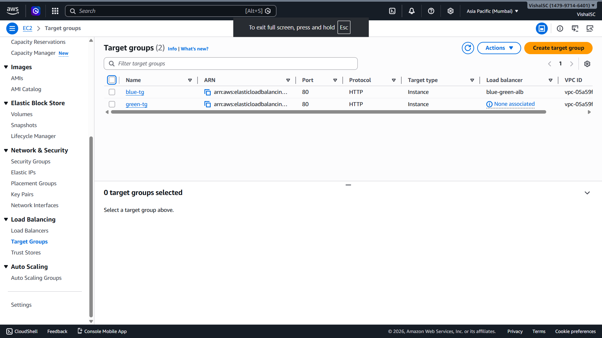
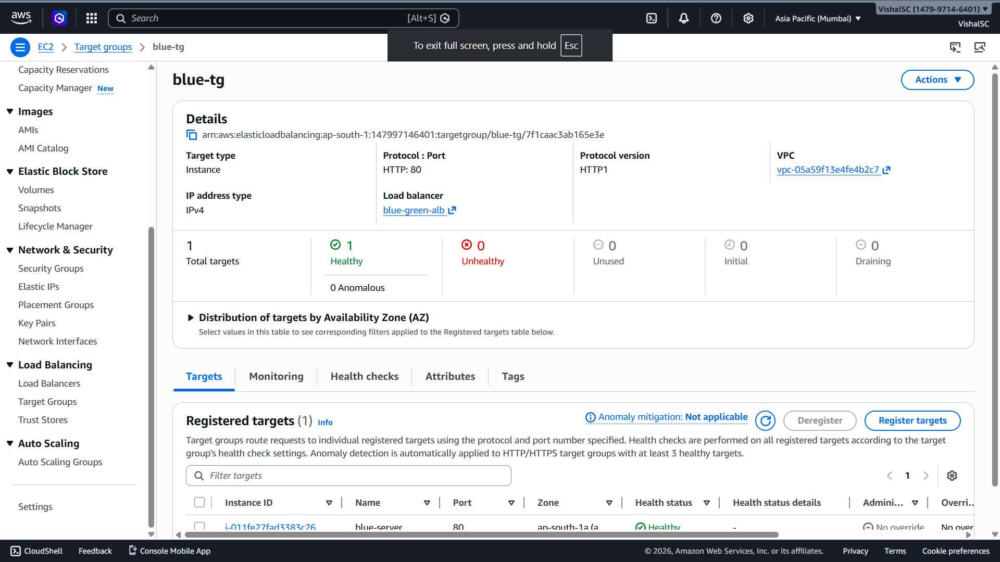
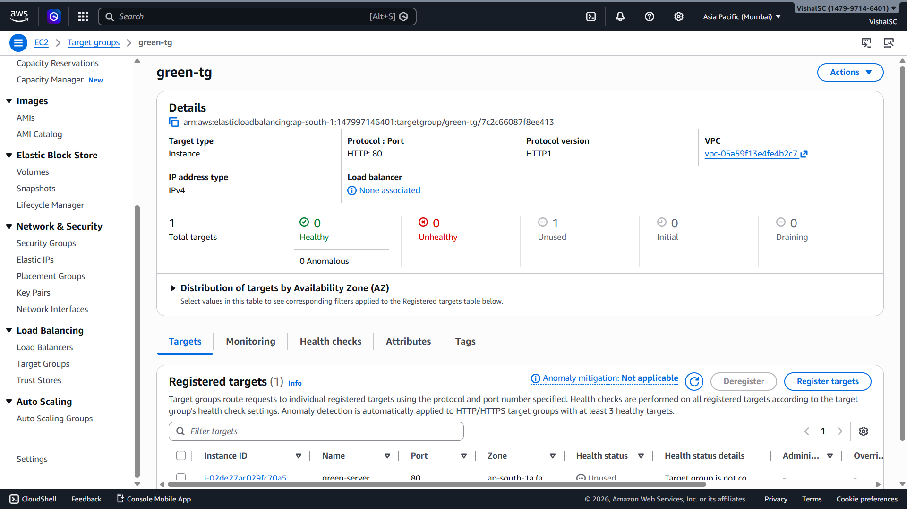
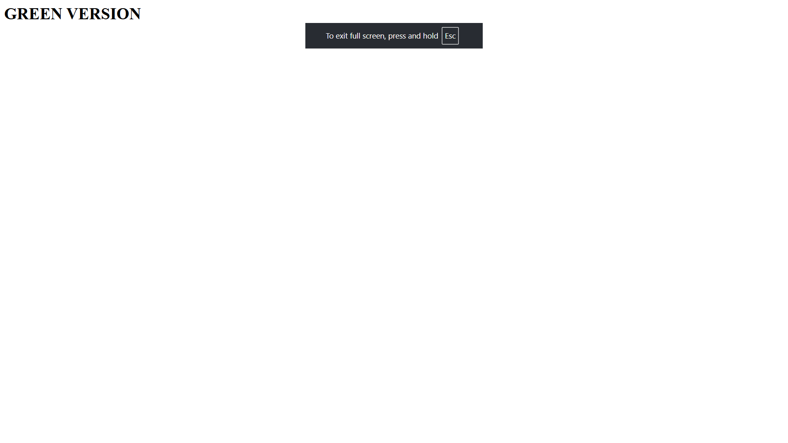
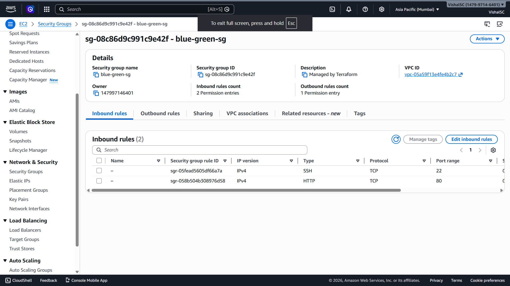

# Zero Downtime Blue Green Deployment on AWS using Terraform

This project demonstrates a Blue Green deployment strategy on AWS using Terraform and Application Load Balancer.
The objective of this project is to deploy application updates with zero downtime and provide a quick rollback option.

Region used: ap-south-1  
Operating system: Amazon Linux  
Tool used for infrastructure: Terraform

---

## Project summary

Two separate environments are created.

Blue environment represents the currently live version.  
Green environment represents the new application version.

An Application Load Balancer controls the traffic and allows switching between the two environments without service interruption.

---

## Architecture overview

The infrastructure consists of:

- EC2 instances for Blue and Green environments
- Application Load Balancer
- Two target groups
- Security groups
- Networking components created through Terraform

---

## Screenshots and explanation

---

### EC2 instances for Blue and Green environments

This screen shows both Blue and Green EC2 instances created by Terraform.

---

### Application Load Balancer

This screen shows the Application Load Balancer created for routing application traffic.

---

### Listener forwarding configuration

This screen shows how the listener forwards traffic to the selected target group.

This is where traffic switching between Blue and Green is controlled.

---

### Target groups

This screen shows both target groups created for Blue and Green environments.

---

### Blue environment health status

This screen confirms that the Blue environment instances are healthy and ready to serve traffic.

---

### Green environment health status

This screen confirms that the Green environment instances are healthy and ready to receive traffic.

---

### Blue environment application output

This screen shows the application running from the Blue environment through the load balancer.

---

### Green environment application output

This screen shows the application running from the Green environment after traffic switch.

---

### Security group configuration

This screen shows the inbound rules used to allow HTTP and required access for the application.

---

## Deployment workflow

Terraform creates both Blue and Green environments in advance.

Only one target group receives live traffic at a time.

When a new version is ready, traffic is switched to the Green target group using Terraform.

If any issue is found, traffic can be switched back to the Blue target group immediately.

---

## Rollback approach

Rollback is performed by forwarding the load balancer listener back to the Blue target group and applying the Terraform configuration again.

This enables quick and safe recovery without downtime.

---

## Resume ready description

Implemented a zero downtime Blue Green deployment architecture on AWS using Terraform and Application Load Balancer.
Designed parallel application environments and enabled safe traffic switching and rollback for reliable cloud operations.

---

## Author

Vishal Chavan  
Computer Science Engineering student  
Focused on Cloud and DevOps